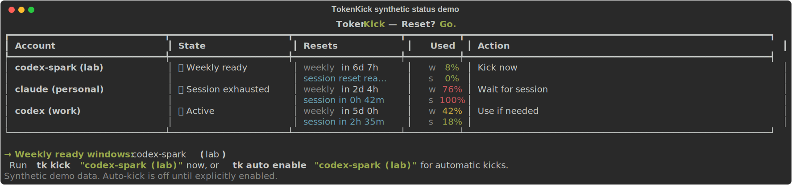
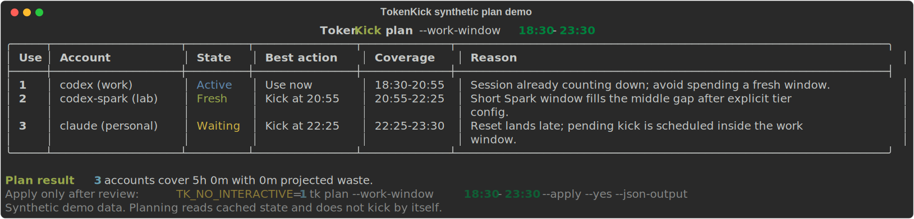
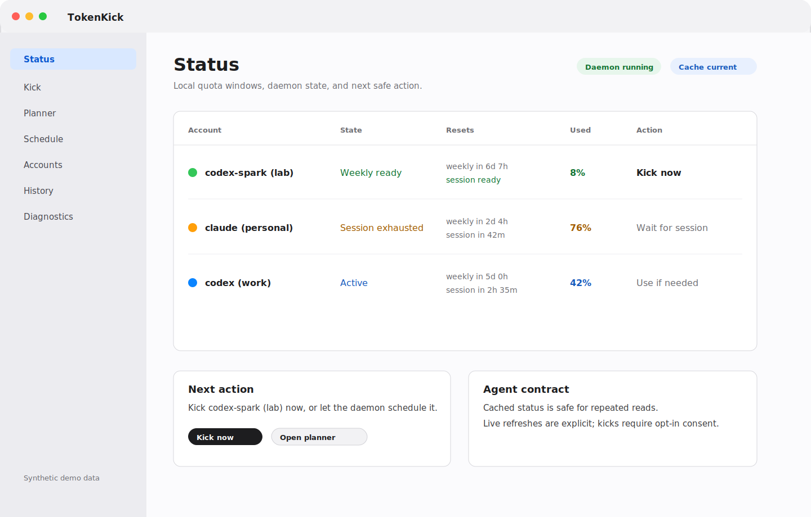
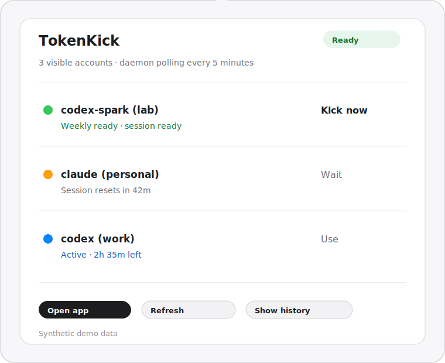

# TokenKick

**Reset? Go.**

TokenKick is a local-first CLI, TUI, beta macOS app, and agent-facing MCP
surface for developers who juggle multiple AI coding accounts. It tracks quota
reset windows, shows which account should be used next, and can optionally send
a tiny provider-native request to anchor a freshly reset window after explicit
opt-in.

It does not increase quota, bypass limits, or move provider credentials into a
TokenKick cloud. It reads the provider state you already have locally and helps
you avoid losing usable hours because a reset happened while nobody noticed.

## At A Glance

- Tracks Codex and Claude quota windows from local provider state where
  available.
- Falls back to local Codex session files and optional CodexBar compatibility
  data when provider-native status is unavailable.
- Separates safe reads from active quota-consuming actions.
- Plans work windows with `tk plan` before scheduling pending session kicks.
- Keeps auto-kick off by default; Codex and Claude automation require explicit
  provider-risk consent.
- Ships local surfaces for humans and agents: terminal UI, scriptable CLI,
  daemon, beta macOS app, Telegram remote status, and MCP server.

## Quick Start

```bash
pipx install tokenkick
tk
```

On first run, `tk` opens the TUI and starts setup when no accounts are saved.
Setup discovers accounts and saves them with auto-kick off by default. If you
later enable auto-kick for Codex or Claude, TokenKick shows a provider-specific
risk notice and requires you to type `ENABLE` before saving the acknowledgment.

For a manual CLI setup:

```bash
tk setup
tk status --refresh
tk auto enable "<label>"
tk notify --ntfy tokenkick-yourname
tk daemon --background
```

For scripts and automation, use explicit commands:

```bash
TK_NO_INTERACTIVE=1 tk status --json-output
TK_NO_INTERACTIVE=1 tk status --refresh --json-output
TK_NO_INTERACTIVE=1 tk plan --work-window 18:30-23:30 --json-output
TK_NO_INTERACTIVE=1 tk run --dry-run --json-output
TK_NO_INTERACTIVE=1 tk history --verbose
TK_NO_INTERACTIVE=1 tk doctor
```

## Demo Gallery

The screenshots below use synthetic demo data and can be regenerated with:

```bash
.venv/bin/python scripts/render-readme-demo.py
```

### CLI / TUI status



### Work-window planning



| macOS app main window | macOS menu bar popover |
|---|---|
|  |  |

## How TokenKick Thinks

TokenKick follows a small loop:

1. **Observe** - read cached or live provider status and normalize account
   windows into states such as fresh, active, waiting, and unknown.
2. **Recommend** - show the next useful action for each account and avoid
   spending fresh windows while another session is still active.
3. **Plan** - map reset windows against a requested work block, then produce a
   deterministic schedule preview.
4. **Act** - only after opt-in, run a tiny provider-native request or let the
   daemon execute due pending kicks through the same guardrails.

Safe diagnostics do not kick or run provider model calls: `tk status`,
`tk accounts detail`, `tk history`, `tk doctor`, `tk reset-log`,
`tk codex-usage`, `tk codex-strategy status`, `tk codex-surfaces`, and
`tk codex-surface-patterns`.

Active actions can consume quota or anchor windows: `tk kick`, `tk run`, force
kicks, and hidden active diagnostics.

## Agent Quick Reference

Agents should read [`llms.txt`](llms.txt) first, then
[`docs/AGENT_PLAYBOOK.md`](docs/AGENT_PLAYBOOK.md). The short version:

- Always set `TK_NO_INTERACTIVE=1`.
- Prefer `--json-output` where available.
- Use cached `tk status --json-output` for repeated reads.
- Use `tk status --refresh --json-output` only when a live provider read is
  genuinely needed.
- Preview active work with `tk run --dry-run --json-output`.
- Never add `--accept-risk ENABLE` unless the user has explicitly approved the
  provider consent text shown by TokenKick.
- Never invent scheduler commands. Use `tk plan`, `tk schedule`, pending kicks,
  and the daemon behavior documented in the playbook.

Minimal agent planning flow:

```bash
TK_NO_INTERACTIVE=1 tk status --json-output
TK_NO_INTERACTIVE=1 tk calendar --json-output
TK_NO_INTERACTIVE=1 tk plan --work-window 18:30-23:30 --json-output
```

## Provider Support

Codex and Claude are kickable in this release. Gemini is monitor-only.
Antigravity is rich monitor-only: TokenKick can show bundled Gemini and
Claude/GPT 5-hour and weekly limits when named windows are available, but it
does not kick them. Logged-in Antigravity CLI accounts are discovered directly;
CodexBar remains a compatibility fallback for named quota-window data. Other
providers are unsupported until their status shape and safe kick behavior are
verified.

Codex-Spark is detected as a separate Codex quota bucket when the provider
exposes it. TokenKick then shows it as a sibling account such as
`codex-spark (...)` with its own session and weekly window. It does not infer
Spark access from your subscription tier. `tk plan` skips Spark until you set
an explicit `usable_session_minutes` for that account, because the rough
placeholder is not enough evidence for orchestration decisions.

## macOS App

The native Mac app is a beta desktop surface for the same local runtime. When
available, beta DMGs are attached to
[GitHub Releases](https://github.com/noriworks/tokenkick/releases). The CLI is
the recommended install path for first-time users; non-notarized beta DMGs may
show a macOS security warning.

Useful app docs:

- [Installing TokenKick.app](docs/macos/INSTALL.md)
- [Updating TokenKick.app](docs/macos/UPDATE.md)
- [Troubleshooting TokenKick.app](docs/macos/TROUBLESHOOTING.md)

## Documentation

- [User overview](docs/README.md)
- [How TokenKick works](docs/HOW_TOKENKICK_WORKS.md)
- [Commands](docs/TOKENKICK_COMMANDS.md)
- [Agent playbook](docs/AGENT_PLAYBOOK.md)
- [MCP server](docs/MCP.md)
- [Magic setup (advanced)](docs/MAGIC_SETUP.md)
- [Providers](docs/PROVIDERS.md)
- [Changelog](docs/CHANGELOG.md)
- [Security](SECURITY.md)
- [Contributing](CONTRIBUTING.md)

## Disclaimer

TokenKick is an independent, open-source project. It is not affiliated with,
endorsed by, or sponsored by OpenAI, Anthropic, Google, or any other provider.
"Codex", "ChatGPT", "Claude", and "Gemini" are trademarks of their respective
owners, used here only to describe compatibility.

TokenKick does not increase your quota, bypass rate limits, or evade any
provider restriction. It helps you track your own reset windows and, optionally,
send a minimal request through a provider's official CLI to anchor a window you
have already paid for.

**Automated or scheduled kicking may violate a provider's Terms of Service.**
Some providers restrict automated or scripted access to their consumer products.
Enabling auto-kick is your decision and your responsibility. You alone are
responsible for how you use TokenKick with your accounts and for complying with
each provider's terms. Use at your own risk.

TokenKick is provided "as is", without warranty of any kind. The authors are
not liable for any consequence arising from its use, including account
restriction, suspension, or loss of access.
